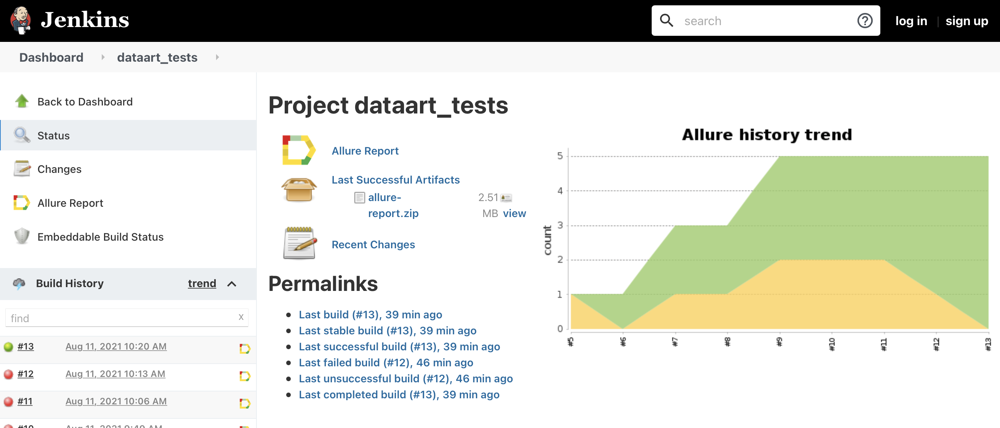

# Autotests for DataArt
___
## Stack
| GitHub | IntelliJ IDEA | Java | Gradle | Junit5 | Selenide |
|:------:|:----:|:----:|:------:|:------:|:--------:|
|  |  |  |  |  |  |

| Jenkins | Selenoid | Allure Report | 
|:--------:|:-------------:|:---------:|
|  |  |  | 
___

## Run tests in Jenkins Default parameters  

* REMOTE_DRIVER_URL (url address from selenoid or grid. default selenoid.autotests.cloud)
* ALLURE_NOTIFICATIONS_VERSION (default 3.0.1)
* credentials passed through a Jenkins job (used Owner Java library to get them from .properties)

## Telegram channel to look at results 
*telegram integration made through 3d-parties library, settings passed through Jenkins job

## Results in Jenkins with Allure Reports

## Test results video attachment example from Selenoid

